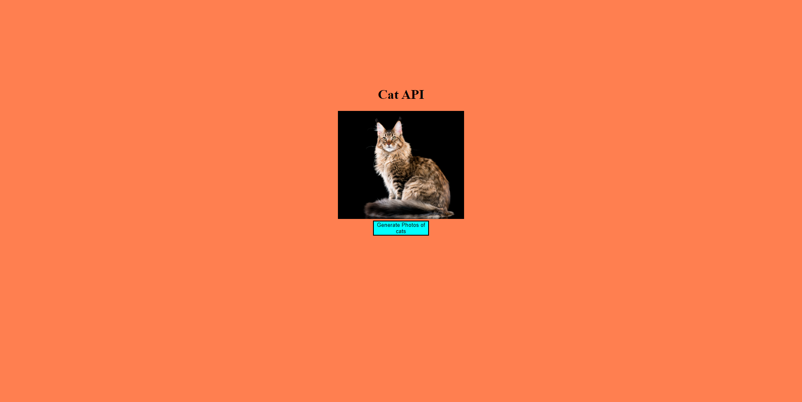

Simple Version
#Description
# Cat-Api-Simple was built using the Cat API https://api.thecatapi.com/
# All it does is fetch a random cat picture and displays it on the screen once the button is pressed.
Cat API is A public service API all about Cats. In this repository, it is the Api for this application.

the Best Cat conscept is desgin to provide family with the infomation needed of the different type of breeds inorder to make the decision about the best breaed of cat that would be suitable for a fmaily when getting a cat. 

#How it works

It populates the Next page button with https://api.thecatapi.com/v1/breeds
Requests a a row of 6 new Image with https://api.thecatapi.com/images/search?breed_id={{selected_breed.id}} when you click next pages 
This then shows anothr 6 random Image for that Breed.

# Tech stack
Core:
- HTML
- JavaScrip
- Bootstrap
- CSS
- Jquery

Communication tool:
- fetch
#Tool
- Visual studio Code

# Preview

